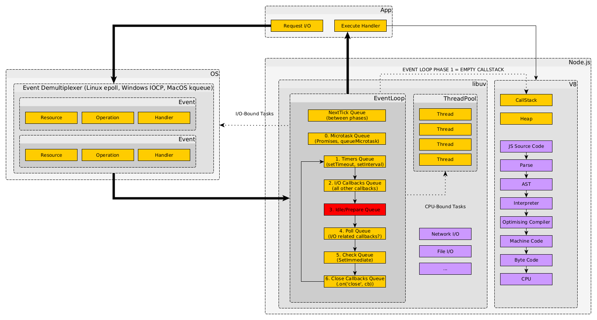

# NodeJS Interview Questions

Материалы взяты из различных источников

## Общие вопросы

<details>
    <summary>1. Какие парадигмы программирования поддерживает JavaScript?</summary>

    JS — мультипарадигменный язык. 

    Поддерживает следующие парадигмы:
    * OLOO (прототипное наследование)
    * OOP
    * EDP (Event-driven programming) (событийно-ориентированное)
    * процедурное программирование — последовательно выполняемые операторы можно собрать в подпрограммы (в том числе — функции)
    * FP (функциональное прогарммирование) — процесс вычисления трактуется как вычисление значений функций. Не предполагается хранения явного состояния. Ключевые слова: функции высших порядков (могут принимать другие функции в качестве аргументов и возвращать функции, см: функции обратного вызова, каррирование, ...), чистые функции (не имеют побочных эффектов, результат зависит только от входных данных, что позволяет кешировать результаты, см: мемоизация), рекурсия, замыкания и т. д.
</details>

<details>
    <summary>2. Функциональное программирование. Плюсы и минусы</summary>

    Основные концепции ФП:
    * Чистые функции — детерминированные функции без побочных эффектов
    * Композиция функций — процесс комбинирования нескольких функций с целью создания новой функции или выполнения вычислений
    * Избегание общего состояния, мутабельных типов данных (вместо этого новые данные извлекаются из существующих), побочных эффектов

    Плюсы ФП:
    * Более декларативный код
    * Высокий уровень абстракции
    * Более предсказуемый и понятный код, т. к. чистые функции не мутируют состояние и результат их работы зависит только от входных данных
    * Простота тестирования и отладки
    * Первоклассные функции в некоторых случаях легко переиспользовать (передавать как параметры, возвращать из других функций и т. д.)
    * С помощью композиции можно объединять функции в цепочки, избегая таким образом использования функций в теле других функций (что создаёт зависимости)
    * Использоваие каррирования и частичного применения (техники, похожие на перегрузку функций в других парадигмах)

    Минусы ФП:
    * математическая терминология
    * потребление памяти (создание новых переменных вместо мутирования существующих, что удваивает использование памяти)
    * использование рекурсии может привести к низкой производительности
    * иногда написание чистых функций ухудшает читаемость кода
    * тяжело поддерживать большую кодовую базу
</details>

<details>
    <summary>3. ООП. Плюсы и минусы</summary>

    Классическое наследование — экземпляр наследует от класса. В JavaScript экземпляры создаются с помощью оператора new и вызова функции-конструктора.
    
    Основные концепции ООП:
    * инкапсуляция — сокрытие информации в классе
    * абстракция — отделение или сокрытие сложности имплементации за более простым интерфейсом
    * наследование 
    * полиморфизм — способность функции обрабатывать данные разных типов

    Плюсы ООП:
    * Легко понять концепцию объектов и значение методов
    * В некоторых случаях легко разделить работу над проектом в терминах объектов (отобразить проблемную область в объекты)
    * Легко использовать прицнипы сокрытия информации
    * Возможно расширить функциональность классов с помощью extend (наследование)
    * Классы зачастую можно переиспользовать
    * Код достаточно легко сопровождать

    Минусы ООП:
    * Подходит не для всех типов проблем
    * Требуется внимательный подход к планированию классов
    * Зачастую требует больше строк кода, чем другие способы организации кодаы
    * Использование классов может отрицательно сказаться на производительности
    * Объекты и поведение связаны вместе
    * Методы объектов могут быть вызваны в случайном порядке
    * Многоуровнвое наследование классов является анти-паттерном
</details>

4. Что такое TDZ (Temporal Dead Zone)?
5. Чем отличаются необъявленная переменная от переменных, содержащих `null` или `undefined`?
6. Как определяется значение `this`?
7. Что такое hoisting (поднятие)?
8. Разница между `var`, `let`, `const`?
9. Область видимости функций и блочная область видимости
10. 'use strict'
11. `0.3 – (0.2 + 0.1)` вернёт очень маленькую дробь. Как проверить, что 0.3 равно 0.2 + 0.1?
12. Что выведет следующий код?

```
const length = 10;

function fn() {
	console.log(this.length);
}

const obj = {
    length: 5,
    method: function(fn) {
        fn();
        arguments[0]();
    }
};

obj.method(fn, 1);
```

13. `const a = [1, 2, 3]`. Что произойдёт при `a[10] = 99`? Что выведет `console.log(a[6])`?
14. Поднятие (hoisting)?
15. AJAX
16. Что выведет следующий код?

```
(function(){
  var a = b = 3;
})();
```

17. Типы ошибок в JavaScript
18. Чем отличается лексическая область видимости от динамической?
19. Обработка исключений
20. Оператор `!!`
21. Разница между spread- и rest-операторами
22. Проверка чётности числа без оператора `%`
23. Проверка существования подстроки в строке
24. Как проверить, является ли число конечным?
25. Чем отличается `isNaN()` от `Number.isNaN()`?
26. Garbage collector
27. Как обработать неперехваченные исключения в Node?
28. NODE_ENV
29. globals

## Algorithms

1. QuickSort
2. MergeSort
3. DFS
4. BFS

## Architecture

1. Какие плюсы и минусы у монолитной и микросервисной архитектур?

## API

* REST
* GraphQL
* RPC
* gRPC
* SOAP
* HATEOAS
* XML-RPC
* GSON
* BPEL
* BPM
* ESB

## Async/await

1. Сравните использование async/await и генераторов

## Authentication

1. Token-based authentication
2. JWT
3. OAuth

## Buffer

1. ArrayBuffer
2. TypedArrays
3. DataView

<details>
    <summary>4. Buffer</summary>
    Буфер — порция передаваемых данных
    Buffer — объект, предоставляющий способ работы с бинарными данными различного вида. Используется для представления последовательности байт (именно байт, а не бит) фиксированной длины.

    Класс Buffer является подклассом класса Uint8Array, который, в свою очередь, является подклассом класса TypedArray. И, соответственно, все методы TypedArray доступны для буферов (с некоторыми ограниченями).

    ```
    console.log(Buffer.__proto__)                         // [Function: Uint8Array]
    console.log(Buffer.__proto__.__proto__)     // [Function: TypedArray]
    ```

    Иерархия классов:
    * ArrayBuffer
        * TypedArray
            * Int8Array
                * Buffer

    Свойство экземпляра .buffer возвращает объект ArrayBuffer, на базе которого Buffer был создан:

    ```
    const buff = Buffer.alloc(16)
    console.log(buff.buffer)
    ```

    Для заполнения буфера можно использовать метод .fill():

    ```
    const buffer = Buffer.alloc(8)
    buffer.fill(1) // <Buffer 01 01 01 01 01 01 01 01>
    ```

    ## Аллокация

    Выделить память под буфер можно используя статические методы:
    * Buffer.alloc(size, fill?, encoding?) — если не указан fill, заполняется нулями
    * Buffer.allocUnsafe(size) — быстрее, но может содержать чувствительные данные, которые ранее содержались в памяти, причём не только те, которые содержались в буферах
    * Buffer.allocUnsafeSlow(size) — ???

    где size — объём в байтах
    fill — значение, которым будет заполнен буфер, может быть типов: string, Buffer, Uint8Array, integer.

    Байты при этом заполняются циклически:

    ```
    Buffer.alloc(16, 0xEF)  // <Buffer ef ef ef ef ef ef ef ef ef ef ef ef ef ef ef ef>

    Buffer.alloc(16)            // <Buffer 00 00 00 00 00 00 00 00 00 00 00 00 00 00 00 00>
    Buffer.alloc(16, 10)     // <Buffer 0a 0a 0a 0a 0a 0a 0a 0a 0a 0a 0a 0a 0a 0a 0a 0a>
    Buffer.alloc(16, 161)   // <Buffer a1 a1 a1 a1 a1 a1 a1 a1 a1 a1 a1 a1 a1 a1 a1 a1>
    Buffer.alloc(16, 256)   // <Buffer 00 00 00 00 00 00 00 00 00 00 00 00 00 00 00 00>

    Buffer.alloc(16, 'A')       // <Buffer 41 41 41 41 41 41 41 41 41 41 41 41 41 41 41 41>
    Buffer.alloc(16, 'AB')     //<Buffer 41 42 41 42 41 42 41 42 41 42 41 42 41 42 41 42>
    ```

    Получать доступ к байтам буфера можно по индексу. При этом мы получаем значение байта в виде целого числа в десятичной системе счисления!

    Так же возможно вносить изменения:

    ```
    const buffer = Buffer.alloc(16, 'HELLO')
    console.log(buffer)          // <Buffer 48 45 4c 4c 4f 48 45 4c 4c 4f 48 45 4c 4c 4f 48>
    console.log(buffer[0])     // 72
    buffer[0] += 1
    console.log(buffer)          // <Buffer 49 45 4c 4c 4f 48 45 4c 4c 4f 48 45 4c 4c 4f 48>
    ```

    Кроме того, можно использовать статический метод Buffer.from(), который в качестве первого аргумента может принимать значения типов: array, arrayBuffer, buffer, string. Все примеры ниже дают один и тот же резульата:

    ```
    // <Buffer 68 65 6c 6c 6f>
    Buffer.from([0x68, 0x65, 0x6c, 0x6c, 0x6f])
    Buffer.from([104, 101, 108, 108, 111])
    Buffer.from(Buffer.alloc(5, 'hello'))
    Buffer.from('hello')
    ```

    ## Побитовые операции

    Для работы с отдельными битами можно использовать побитовые операции и битовые маски.

    Побитовые операторы в JavaScript:
    | AND | OR | XOR | NOT | LS | RS |
    |-----|----|-----|-----|----|----|
    | &   | \| | ^   | ~   | << | >> |

    На примере сдвига влево:

    ```
    const buffer = Buffer.alloc(1, 0xAB)
    console.log(buffer) // <Buffer ab>
    console.log(buffer[0], buffer[0].toString(2).padStart(8, '0')) // 171 10101011
    buffer[0] <<= 1
    console.log(buffer[0], buffer[0].toString(2).padStart(8, '0')) // 86 01010110
    buffer[0] <<= 1
    console.log(buffer[0], buffer[0].toString(2).padStart(8, '0')) // 172 10101100
    buffer[0] <<= 1
    console.log(buffer[0], buffer[0].toString(2).padStart(8, '0')) // 88 01011000
    ```

    Комментарий: 10101011 -> 0101011|0 -> 101011|00 -> 01011|000

    ## Использование битовых масок.

    Допустим, нам необходимо извлечь из байта биты 2—5. Для этого необходимо создать маску 00111100, где единицы стоят на местах соответствующих битов, после чего совершить сдвиг вправо на две позиции (2 пропущенных бита). 

    Маска 0011 1100 в шестнадцатеричной СС выглядит как 3C:

    ```
    const mask = Buffer.alloc(1, 0x3C)[0]
    console.log(mask.toString(2).padStart(8, '0'))      // 00111100
    const buff = Buffer.alloc(1, 0xAA)
    console.log(buff[0].toString(2).padStart(8, '0'))   // 10101010
    buff[0] &= mask
    console.log(buff[0].toString(2).padStart(8, '0'))   // 00101000
    buff[0] >>= 2
    console.log(buff[0].toString(2).padStart(8, '0'))   // 00001010
    console.log(buff[0])                                                       // 10
    console.log(buff)                                                            // <Buffer 0a>
    ```

    ## Итерирование 

    Для итерирования можно использовать как обычные циклы, так и for of:

    ```
    const buff = Buffer.alloc(16, 'HELLO WORLD')

    for (const byte of buff) {
        console.log(String.fromCharCode(byte))
    }

    const it = buff[Symbol.iterator]()
    console.log(it.next())
    ```

    ## Кодировки

    Для преобразования в строку можно использовать метод .toString(). При этом, если не указана кодировка, NodeJS использует UTF-8 по-умолчанию:

    ```
    const buffer = Buffer.from([0x68, 0x65, 0x6c, 0x6c, 0x6f, 0xd0, 0xbc, 0xd0, 0xb8, 0xd1, 0x80])

    console.log(buffer)                                             
    console.log(buffer.toString()) // helloмир
    ```

    Здесь в UTF-8 первые пять байт соответствуют 5 латинским буквам, а оставшиеся 6 — трём кириллическим (по 2 байта на каждую).

    Кроме того поддерживаются кодировки:
    * urf8
    * utf16le
    * latin1
    * base64
    * base64url
    * hex

    ```
    console.log(buffer.toString('utf16le'))       // 敨汬큯킼톸
    console.log(buffer.toString('latin1'))          // helloмиÑ
    console.log(buffer.toString('base64'))       // aGVsbG/QvNC40YA=
    console.log(buffer.toString('base64url')) // aGVsbG_QvNC40YA
    console.log(buffer.toString('hex'))             // 68656c6c6fd0bcd0b8d180
    ```

    ## Методы экзмепляра read. Int vs UInt

    Int — формат, используемый для представления целых положительных и отрицательных чисел. Для представления только положительных чисел может использоваться беззнаковое представление UInt. 

    * Int — signed integer — знаковое целое число
    * UInt — unsigned integer — беззнаковое число

    При использовании Int при установленном крайнем левом бите (sign bit) число становится отрицательным. Для вычисления актуального значения отрицательного числа, представленного таким образом, необходимо вычислить дополнительный код: вычислить обратный код (заменить 0 на 1, а 1 на 0) и прибавить 1.

    Пример:

    ```
    0x8A -> 10001010 -> 01110101 + 1 -> 01110110 -> 118
    ```

    Для доступа к отдельным байтам может использоваться вспомогательные объекты-представление, общее название которых — TypedArray (типизированный массив), например:
    * Int8Array, Int16Array, Int32Array
    * Uint8Array, Uint16Array, Uint32Array
    * существуют и другие!

    где число указывает на количество бит (не байт!), которое нужно прочитать:

    ```
    const buffer = Buffer.alloc(1, 0x8A)
    console.log(buffer.readUint8())
    console.log(buffer.readInt8())
    ```

    В качестве аргумента можно передать оффсет — смещение в байтах.   

    ## LittleEndian vs BigEndian

    LE и BE — варианты порядка записи байт в памяти:
    * BigEndian — порядок записи от старшего байта к младшему, то есть слева-направо в привычном порядке.
    * LIttleEndian — порядок чтения от младшего байта к старшему, то есть справа-налево.

    ```
    const buffer = Buffer.from('message!')

    console.log(buffer)                                 // <Buffer 6d 65 73 73 61 67 65 21>
    console.log(buffer.readUInt16BE()) // (1) 28005
    console.log(buffer.readUint16LE())  // (2) 25965
    ```

    Пояснения:
    6d 65 73 73 61 67 65 21 = 0110 1101 | 0110 0101 | 0111 0011 | 0111 0011 | 0110 0001 | 0110 0111 | 0110 0101 | 0010 0001
    1) 0110 1101 | 0110 0101 = 28005 (два первых байта)
    2) 0110 0101 | 0110 1101 = 25965 (два первых байта справа налево)

    ## Получение фрагмента буфера

    Метод  экземпляра .subarray() возвращает новый буфер, который ссылается на ту же область памяти, что и оригинал. При этом можно указать индексы начала и конца среза, получив таким образом фрагмент (ссылку на фрагмент) исходного буфера.

    ```
    const buffer = Buffer.from('message!')  // <Buffer 6d 65 73 73 61 67 65 21>

    const buffer2 = buffer.subarray(1, 3)
    buffer2[0] = 0x00

    console.log(buffer2) // <Buffer 00 73>
    console.log(buffer) // <Buffer 6d 00 73 73 61 67 65 21> изменился!

    // may vary:
    console.log(buffer.byteOffset) // 0
    console.log(buffer2.byteOffset) // 1
    ```

    (offset считается для лежащего в основе TypedArray, внутри пула выделяенной памяти?)
</details>

## Child Processes/Threads

<details>
    <summary>1. Разница между child process и worker threads</summary>

    Worker Threads позволяют запускать множество тредов параллельно в одном экземпляре NodeJS. Используются, когда не нужна такая изоляция, как у процессов: в отличии от child_process и cluster, треды могут расшаривать память. Это делает с помощью передачи экземпляров ArrayBuffer или расшаривания экземпляров SharedArrayBuffer. 

    Используются для CPU-интенсивных операций. Не слишком эффективны для I/O-интенсивных операций. Встроенные в NodeJS асинхронные функции справляются с этим лучше.
</details>

<details>
    <summary>2. node:child_process</summary>

    ## spawn()

    index.js:
    ```
    const { spawn } = require('node:child_process')

    const nodeHello = spawn('node', ['hello.js'])

    nodeHello.stdout.on('data', data => {
        console.log('Node.js:', data.toString())
    })
    ```

    hello.js:
    ```
    setInterval(() => {
        process.stdout.write('Subprocess: hello')
    }, 1500)
    ```

    Spawn'ит подпроцесс (запускает команду как новый процесс). 

    Функция spawn возвращает экземпляр класса ChildProcess, который имеет свойства stdin, stdout, stderr. (т. е. между родительским процессом и подпроцессами устанавливаются конвееры). При этом не создаётся нового экземпляра V8.

    ChildProcess, в свою очередь, имплементирует EvenEmitter API, поэтому мы можем использовать метод on.

    Spawn не создаёт shell для выполнения команд.

    Использует стримы. Поэтому выгодно использовать для управления процессами, порождающими большое количество данных или работающими с чтением больших данных. Кейс: хотим, чтобы дочерний процесс вернул большое количество данных родительскому процессу, например 1GB видео.

    Есть опция options.stdio (смотри документацию):

    ```
    const nodeHello = spawn('node', ['hello.js'], options)
    ```

    Использовать запись в файловый дескриптор дочернего процесса со spawn не получается (создаётся Socket? с которым нельзя взаимодействовать таким образом).

    ## exec()

    index.js:
    ```
    const { exec } = require('node:child_process')

    exec('ls / | grep ^s', (err, stdout, stderr) => {
        process.stdout.write(stdout)
    })
    ```

    Spawn'ит shell и запускает команду в нём, пробрасывая stdout и stderr в callback-функцию. Новый процесс при этом не создаётся.

    Так как использует shell, могут быть запущены потенциально опасные операции.

    Использует буферизацию stdout в памяти. Поэтому имеет смысл использовать, когда объём данных небольшой и нужен синтаксис и функционал shell (например pipe).

    В качестве опций можно установить:
    * cwd — рабочую директорию дочернего процесса
    * shell — по-уомлчанию /bin/sh

    ## execFile()

    index.js:
    ```
    const { execFile } = require('node:child_process')

    execFile('node', ['hello.js'], (err, stdout, stderr) => {
        process.stdout.write(stdout)
    })
    ```

    hello.js:
    ```
    process.stdout.write('Child: hello')
    ```

    Похоже на exec, но не spawn'ит shell по-умолчанию (соответственно, такое как поведение, как, например, перенаправление I/O не поддерживается). Вместо этого указаный исполняемый файл  запускается как новый процесс. То есть под капотом используется тот же spawn.

    Если опция shell активирована, так же могут быть выполнены потенциально опасные операции.

    ## fork()

    index.js:
    ```
    const { fork } = require('node:child_process')

    const child = fork('./hello.js')

    child.on('message', message => {
        console.log('Parent:', message)
    })
    ```

    hello.js:
    ```
    process.send('Child: hello')
    ```

    Специальный случай spawn, используемый для запуска NodeJS-процессов. 

    Функция fork() так же возвращает экземпляр класса ChildProcess, который имеет дополнительный коммуникационный канал для обмена сообщениями (IPC) между родителем и дочерними процессами (метод .send() и обработчик .on('message')). При этом стримы в этом канале не используются.

    * process.send() — для отправки сообщений родительскому процессу из дочерних
    * child.on('message', msg => {}) — для получения сообщений из дочерних процессов родительским

    Дочерние процессы являются независимыми от родительского: имеют собственную память и экземпляр V8. То есть в отличии от fork в POSIX, процесс не клонируется.

    Используем, когда необходимо вынести сложные вычисления из основного цикла событий в отдельный процесс NodeJS.
</details>

<details>
    <summary>3. node:cluster</summary>

    index.js:
    ```
    const http = require('node:http')
    const cluster = require('node:cluster')
    const CPUS = 4

    if (cluster.isPrimary) {
        console.log('Primary! pid:', process.pid)
        for (let i = 0; i < CPUS; i++) {
            cluster.fork()
        }
    } 
    else {
        const handler = (req, res) => { 
            res.end('Hello from HTTP Server! pid:' +  process.pid) 
        }

        http
            .createServer(handler)
            .listen(3000)
    }
    ```

    Кластеры NodeJS-процессов используются для запуска нескольких экземпляров NodeJS (воркеров), между которыми могут быть распределена нагрузка.

    Worker'ы (дочерние процессы) запускаются с помощью child_process.fork(). Соответственно, может использоваться IPC для обмена сообщениями между родительским процессом и воркерами.

    Модуль cluster поддерживает два способа распределения входящих подключений:
    * RoundRobin (стандартный для всех платформ, кроме Windows). Родительский процесс слушает на порту, принимает подключения и распределяет их между воркерами
    * Воркеры принимают входящие подключения напрямую (в теории должно давать лучшую производительность, но на практике — нет)

    ```
    curl localhost:3000 // для проверки RR
    ```

    Так как воркеры — независимые процессы, они могут быть убиты или перезапущены, не влияя при этом на остальные воркеры.
</details>

4. SharedArrayBuffer

## Collections

1. В чём разница между массивом и объектом?
2. Методы массивов `.forEach()` и `.map()`
3. В чём разница между объектами `Map` и `WeakMap`?
4. Как проверить, является ли объект массивом?
5. Какие конструкции языка используются для обхода массивов и объектов
6. Как добавить элемент в начало массива?
7. Как проверить, является ли объект массивом?
8. Как добавить элемент в начало массива?
9. `const a = [1, 2, 3]`. Выбросит ли ошибку `a[10] = 99`? Что выведет `console.log(a[6])`?
10. Как удалить дубликаты из массива?
11. Почему доступ к элементу массива производится за O(1)?
12. Как найти потерянное целое число в массиве с числами от 1 до 100?
13. Как объединить два сортированных массива в один сортированный?
14. Сравнение массивов
15. Как отсортировать массив нулей и единиц?
16. Дан массив и целевая сумма двух элементов. Как найти индексы элементов, которые дают такую сумму?
17. В чем разница между `Set` и `WeakSet`?
18. `Map`
19. `Set`
20. `WeakMap`
21. `WeakSet`

## Data Types/Formats

1. Как можно написать собственную функцию `isInteger(x)`
2. Что такое `NaN`? Какой у `NaN` тип? Как проверить на `NaN`?
3. Как проверить null?
4. Что такое ступенчатый (зубчатый, jagged) массив?
5. В чём разница между примтивными типами и объектными типами?
6. JSON
7. Мутабельные и иммутабельные типы данных
8. Boxing/unboxing в JavaScript
9. Почему не стоит использовать конструкторы типа new String?
10. Записи (records) и кортежи (tuples)
11. Почему `typeof null` возвращает `object`?
12. Как происходит преобразование типов в следующих примерах:

```
    {}+[]+{}+[1]
    !!"false" == !!"true"
    ['x'] == 'x'
```

13. Symbol

## Data Structures

1. Linked List
2. Stack
3. Queue
4. Binary Tree
5. BST
6. Heap
7. Priority Queue

## Databases

1. Чем отличается embed- от reference-связи в MongoDB?
2. ActiveRecord и DataMapper
3. Транзакции
4. ACID
5. n + 1
6. MongoDB Aggregation Pipeline

## EventLoop/Node.js Architecture



<details>
    <summary>1. EventLoop (Цикл событий)</summary>


    В браузере:

    * Call Stack. Часть движка JS (V8)
    * Task Queue. Часть EventLoop. На самом деле две очереди FIFO:
        * Macrotask Queue (aka Event Queue)
        * Microtask Queue (aka Task Queue, aka Promise Jobs).
    * Web APIs
        * отвечает за регистрацию событий, таймаутов и ... ?

    За что отвечает движок (V8):
    * Heap — место аллокации памяти для всех переменных, объявленных в программе (код функций, например, тоже аллоцируется в памяти)
    * Call Stack — стек, в который добавляются функции, выполняются одна за другой и удаляются, когда выполнение завершено
    * malloc, garbage collector
    * компиляция в машинный код
    * оптимизации

    EventLoop не является частья движков. EventLoop предоставляется средой (NodeJS, браузер, ...)

    Микрозадачи:
    * Promise (99% случаев)
    * queueMicrotask — явное создание микрозадач
    * mutationObserver (только браузер, часть WebAPI)

    Макрозадачи:
    * Таймеры
    * События
    * I/O
    * ....

    * Задачи из Task Queue попадают в Call Stack только после того как Call Stack очистится.
    * В приоритет всегда микрозадачи. Разом выполняются ВСЕ микрозадачи, а потом ОДНА макрзадача (так как макрозадача может породить микрозадачу)

    Три фазы EventLoop:
    1. Call Stack (пока не опустеет)
    2. Microtask Queue (все задачи)
    3. Macrotask Queue (одна задача)

    ---

    В NodeJS:

    Задача NodeJS — преобразовать код JS в машинный код.

    Составные части:
    * Движок V8
    * libuv
        * кроссплатформенный I/O
            * работа с файлами
            * работа с сетью
        * EventLoop

    Libuv управляет пулом потоков Thread Pool (по-умолчанию четырьмя)

    Думультиплексор событий — механизм ОС для организации неблокирующего ввода/вывода (epoll, IOCP, kqueue в Linux, Windows, MacOS, соответственно)

    Фазы EventLoop:
    0. не указано в доке — Promise
    1. Timers (таймеры): setTimeout, setInterval 
    2. I/O-callbacks: все обратные вызовы, кроме setTimeout, setInterval, setImmediate и событий 'close'. В том числе on. 'error'. Название очереди — Callback Queue
    3. Idle/Prepare (ожидание/подготовка) — только для внутренних нужд (пример: составить отчёт о производительности в момент простоя приложения). У программиста нет никакого доступа
    4. Poll (опрос) — получение новых событий ввода-вывода. Здесь Нода может блокироваться, если необходимо. Когда завершается выполняемая в фоновом режиме операция, ядро ОС сообщает Ноде, что функция обратного вызова этой операции может быть добавлена в Poll Queue (название очереди). В основном I/O-операции чтения файлов? По сути — опрос событий, который будут выполнены в следующей (?) итерации? setImmediate
    5. Check (проверка) — обратные вызовы setImmediate
    6. Close Callbacks — обратные вызовы .on 'close'

    * Каждая фаза имеет FIFO-очередь обратных вызовов. Итого 6 очередей! В официальной доке в псевдокоде описаны три:
        * pendingTimers (setTimeout, setInterval)
        * pendingOSTasks (сервер, слушающий порт, например)
        * pendingOperations (долгие операции, например чтение файловой системы)
    * Когда EventLoop входит в конкретную фазу, он запускает функции обратного вызова из очереди этой фазы до тех пор, пока очередь не опустеет!
    * Когда очередь очередной фазы опустеет, EventLoop переходит к следующей фазе
    * Коллбэки process.nextTick() срабатывают в ту же фазу, где были вызваны (считай — между фазами)

    Приоритетные очереди (исполняются, когда EventLoop не находится ни в одной из перечисленных фаз):
    * nextTickQueue
    * Microtask Queue
</details>

2. В чём разница между стеком вызовов и очередью задач?
3. Микрозадачи и макрозадачи
4. Преимущества однопоточной модели Node.js
5. Разница между `process.nextTick` и `setImmediate`?
6. Thread pool
7. V8
8. Почему при рекурсивном вызове `nextTick` блокирует цикл событий, а `setImmeidate` — нет?
9. Паттерн Reactor и Node.js

## EventEmitter

<details>
    <summary>1. EventEmitter</summary>

    Большая часть API NodeJS построена по принципу Event-Driven архитектуры:
    * объекты-emitter'ы эмитируют именованные события
    * эти события приводят в вызову функций-обработчиков (listeners)

    Все объекты, эмитирующие события — экземпляры класса EventEmitter, предоставляющего методы:
    * .emit() — эмитирует события
    * .on() — связывает обработчик (или несколько) с событием

    Обработчики, связанные с событием выполняются СИНХРОННО в порядке их регистрации, что позволяет убедиться в корректной последовательности выполнения действий и избежать race condition. Все возвращаемые обработчиками значения игнорируются.

    При необходимости обработчики событий всё же можно перевести в асинхронный режим, используя setImmediate() или process.nextTick()

    Часто используется extends для создания подкласса:

    ```
    const EventEmitter = require('node:events')

    class MyEmitter extends EventEmitter {}
    cinst myEmitter = new MyEmitter()

    myEmitter.on('event', () => {})
    myEmitter.emit('event')
    ```

    Возможна передача аргументов обработчикам:

    ```
    myEmitter.on('event', (name1, name2) => {})
    myEmitter.emit('event', 'alice', 'bob')
    ```

    Только при использовании обычных (не стрелочных) функций в качестве обработчиков, this будет привязано к конкретному экземпляру EventEmitter!

    Кроме того:
    * myEmitter.once('event', () => {}) — для однократной обработки события
    * myEmitter.emit('error', new Error()) — считается особым случаем

    Класс EventEmitter:
    * Каждый раз, когда добавляется новый обработчик, EventEmitter эмитирует событие 'newListener', а когда обработчик удаляется — событие 'removeListener'

    Экземпляры класса:
    * emitter.on(eventName, listener) = emitter.addListener(eventName, listener)
    * emitter.prependListener(eventName, listener) — добавить обработчик в начало массива обработчиков
    * emitter.eventNames() — массив имён событий
    * emitter.listeners(eventName) — массив функций-обработчиков события
    * emitter.off(eventName, listener) = emitter.removeListener(eventName, listener)
    * emitter.removeAllListeners(eventName)
</details>

## Functions

1. Первоклассные функции
2. Разница между `.call()`, `.apply()` и `.bind()`
3. Зачем использовать IIFE?
4. Когда следует использовать стрелочные функции?
5. Для чего обычно используются анонимные функции?
6. Генераторы
7. Когда стоит использовать генераторы?
8. Что такое замыкание? Приведите примеры
9. Почему запись `function foo(){}()` не работает как IIFE?
7. Объясните разницу между `person = Person()` и `person = new Person()`
8. Что выведет следующий код?

```
(function(){
    var a = b = 3;
})();

console.log(typeof a !== 'undefined');
console.log(typeof b !== 'undefined');
```

9. Зачем заключать всё содержимое JS-файла в блок функции?
10. Напишите функцию sum, которая будет работать корректно как `sum(2, 3)`, так и `sum(2)(3)`
11. Что такое замыкания? Приведите примеры
12. Почему запись `function foo(){}()` не работает как IIFE?
13. Обход массивов
14. Что выведет следующий код?

```
const length = 10;

function fn() {
	console.log(this.length);
}

const obj = {
    length: 5,
    method: function(fn) {
        fn();
        arguments[0]();
    }
};

obj.method(fn, 1);
```

15. Как работает метод `.reduce()`?
16. this в обычной и стрелочной функциях
17. Функции высшего порядка
18. Как бы вы реализовали метод `Array.prototype.map`?
19. Как бы вы реализовали метод `Array.prototype.filter`?
20. Как бы вы реализовали метод `Array.prototype.reduce`?
21. Объект arguments
22. Как бы вы реализовали вспомогательную функцию мемоизации?
23. Как узнать, сколько аргументов ожидает получить функция?
24. Работа с датами в JS
25. Каррирование
26. Частичное применение
27. Что выведет следующий код?

```
let f = function() {
    console.log(1);
}

const execute = function(f) {
    setTimeout(f, 1000);
}

execute(f);

f = function() {
    console.log(2);
}
```

28. Потеря контекста
29. Итераторы
30. Приведите примеры использования мемоизации
31. Функции обратного вызова (callbacks)
32. Позднее связывание

## HTTP

1. Версии протокола HTTP
2. Коды ответа (состояние) HTTP
3. Ограничения встроенного модуля http в Node.js?
4. Типы HTTP-запросов
5. В чём разница между HTTP-методами PUT, POST, UPDATE?
6. TCP и HTTP
7. HTTPS

## Modules. Packages

1. CommonJS
2. ES2015
3. Паттерны импортирования модулей
4. package-lock.json
5. Разница между `npm install` и `npm ci`
6. Плюсы yarn по сравнению с npm?
7. Локальная и глобальная установкой npm-пакетов
8. DI

## Objects

1. В чём разница между `Object.freeze()` и ключевым словом `const`?
2. Как организовать глубокую заморозку объекта?
3. Как сделать копию объект? Глубокая (deep) копия и поверхностная (shallow)
4. Почему не следует использовать `x === 'object'` для проверки того, что x — объект?
5. Что выведет следующий код?

```
let a = {}
let b = { key: 'b' }
let c = { key: 'c' }

a[b]=123
a[c]=456

console.log(a[b]);
```
6. Способы клоинрования объектов
7. Объясните разницу между `const person = Person()` и `const person = new Person()`
8. В чём проблема с `typeof bar === 'object` для проверки того, что bar — объект? Как её избежать?
9. Что выведет следующий код?

```
const a = {},
const b = {key:'b'},
cinst c = {key:'c'};
a[b] = 123;
a[c] = 456;
console.log(a[b]);
```

10. Что выведет следующий код?

```
const obj = {}
console.log(obj.someprop.x)
```

11. Проверка наличия свойства в объекте
12. Разница между `Object.freeze()` и `Object.seal()`
13. Как проверить, что объект является пустым?
14. Разница между `===` и `Object.is()`
15. Что такое аксессоры?
16. DMZ-объекты
17. Деструктуризация объектов
18. Способы копирования простого объекта типа `obj = { a: 1, b: 2, c: 3 }`
19. Функция structuredClone()
20. Дескрипторы свойств объектов
21. Создание неизменяемых объектов

## OOP. Classes

1. Классическое наследование и прототипное наследование
2. Разница между ES6-классами и конструкторами функций
3. Классы в JS
4. Статические классы
5. Абстрактные классы
6. Инкапсуляция. Приёмы в JS
6. Полиморфизм. Приёмы в JS
7. Разница между композицией и наследованием
8. SOLID

## Patterns

1. Открытый модуль (Revealing Module)
2. Middleware
3. Observer
4. Pub/sub
5. CQS
6. CQRS
7. Event Sourcing
8. GRASP

## Promises

1. PromiseAPI
2. Преимущества и недостатки использования PromiseAPI вместо обратных вызовов
3. Чем отличается Promise от Observable?
4. Что выведет следующий код?

```
Promise
    .resolve(10)					
    .then(e => console.log(e))
    .then(e => Promise.resolve(e))
    .then(console.log)
    .then(e => {
        if (!e) {
            throw 'Error caught'
        }
    })
    .catch(e => {
        console.log(e)
        return new Error('New error')
    })
    .then(e => {
        console.log(e.message)
    })
    .catch(e => {
        console.log(e.message)
    });
```

5. Разница между `Promise.all()` и `Promise.allSettled()`

## Protocols/Network

1. node:net
2. WebSockets

## Prototypes

1. В чём заключается разница между классическим наследование и прототипным наследованием?
2. Когда прототипное наследование является хорошим выбором?
3. В чём разница между `__proto__` и `prototype`?
4. Можно ли записывать новые свойства/методы в прототипы стандартных классов и в каких случаях? Как обезопасить себя, если нужно расширить прототип? 

## Proxy API/ Reflect API

1. Proxy API
2. Приведите примеры использования Proxy API
3. Reflect API


## RegExp

1. Разница между методами `test()` и `exec()`?
2. Методы для работы с регулярными выражениями в JS

## Security

1. XSS
2. Как происходит проверка правильности пароля при использовании bcrypt?
3. CORS
4. Заголовки CORS

## Standards

1. ECMAScript

## Streams

<details>
    <summary>1. Streams</summary>
    Stream — механизм передачи данных порциями.

    Все стримы — экземпляры EventEmitter. Соответственно, они могут эмитить события, например, когда данные доступны для чтения.

    Иерархия классов выглядит так:

    * EventEmitter
        * Stream
            * stream.Readable
                * fs.readableStream
            * stream.Writable
                * fs.writableStream

    Все стримы в NodeJS работают исключительно со строками и Buffer (Uint8Array). Для работы с другими типами значений Stream (касается только чтения?) должен работать в objectMode.

    Четыре типа стримов в NodeJS:
    * Readable
    * Writable
    * Duplex
    * Transfrom — Duplex-стрим, который может модифицировать данные

    Модуль node:stream (node:stream/promises) может исользоваться для создания новых типов экземпляров стримов. Обычно он не нужен (!) для использования стримов.

    Стоит отметить, что fs.ReadStream и fs.WriteStream — классы, экземпляры которых создаются с помощью fs.createReadStream() и fs.createWriteStream(). 

    Примеры стримов в модулях NodeJS (экзмепляры классов fs.readStream и fs.writeStream):
    * process.stdin
    * process.stdout
    * process.stderr
    * fs.createReadStream
    * fs.createWriteStream

    Экземпляры классов stream.Readable и stream.Writable:
    * net.Socket()

    Стримы хранят данные во внутреннем буфере. Количество буферизуемых данных в байтах устанавливается значением highWaterMark (в objectMode — не в байтах, а в объектах).

    ```
    const readableStream = fs.createReadStream('./data', { highWaterMark: 8 })
    ```

    Как только внутренний буфер заполняется, стрим временно перестаёт читать данные, пока данные их буфера не будут использованы!

    Для того, чтобы добавить содержимое во внутренний буфер, используются методы:
    * readable.push() — добавляет фрагмент,  который будет стоять во внутренней очереди до потребления
    * writable.write() — записывает фрагмент

    Duplex и Transform являются одновременно Readable и Writable, поэтому у них два внутренних буфера.

    Readable стримы используют EventEmitter API для уведомления о том, когда данные готовы быть прочитанными из стрима. Примеры:

    ```
    req.on('data', chunk => {})
    req.on('end', () => {})
    ```

    События Readable-стримов:
    * readable  — стрим приостановлен, но есть доступные данные для чтения, которые можно получить с помощью метода .read(size). Может возникнуть ситуация, когда внутрений буфер стрима будет заполнен и стрим перестанет читать пакеты от ОС.
    * data — запускает стрим. Можно остановить и продолжить передачу с помощью методов pause() и resume()
    * close —
    * end —
    * resume —
    * pause —

    Режимы Readable-стримов:
    * paused — по-умолчанию
    * flowing
    * object

    При этом режимы flowing и paused независимы от  object mode.

    Все Readable-стримы начинают работать в режиме paused, но могут переключаться в режим flowing с помощью:
    * добавления обработчика 'data': `readable.on('data', chunk => {})`
    * вызова readable.resume()
    * вызова readable.pipe(writable)

    Переключиться в режим paused можно с помощью:
    * readable.pause(), если не использовался .pipe()
    * readable.unpipe(), если использовался .pipe()

    Paused:
    ```
    stream.on('readable' () => {
        stream.read(8)
    })
    ```

    Через readableFlowing доступна информация о состоянии:
    * null — не запущен
    * true — flowing
    * false — остановлен с помощью .pause()

    Writable стримы предоставляют методы write() и end() для записи данных в стримы. Примеры

    ```
    res.write()
    res.end()
    ```

    Общий паттерн использования:

    ```
    myStream.write()
    myStream.write()
    myStream.end()
    ```

    Примеры Writable стримов:
    * http res
    * fs write
    * process.stdout
    * process.stderr

    События Writable-стримов:
    * close —
    * error —
    * drain —
    * finish — когда вызван .end()
    * pipe —
    * unpipe —

    Паттерны создания собственных стримов:

    ```
    class MyWritable extends Writable {}
    ```

    ```
    const myWriatble = new Wriatble({})
    ```

    Для создания собственных экземпляров стримов необходимо имплементировать:
    * Readable: _read()
    * Writable: _write(), _writev(), _final()
    * Duplex: _read(), _write(), _writev(), _final()
    * Transform: _transform(), _flush(), _final)_

    Метод .pipe() позволяет соединить вывод Readable-стрима со входом Writable-стрима

    ```
    readable.pipe(writable)
    ```
</details>
2. Разница между `readFile` и `createReadStream`?

## SQL

<details>
    <summary>1. Нормальные формы 1NF, 2NF, 3NF</summary>

    Нормализация — организация данных в БД путём установления отношений между ними, устранения избыточности и несогласованных зависимостей.

    Существуют правила нормализации. Каждое правило называют нормальной формой (NF). Если выполняется первое правило, говорят, что БД в 1NF, если первые три — в 3NF, и т. д.

    Денормализованная база данных содержит большое количество избыточных данных, требуется меньше join'ов во время запросов. В нормализованной — наоборот (меньше избыточности, больше join'ов).

    Пример таблицы без нормализации:

    | Name        | Address             | Movies                                          |
    |-------------|---------------------|-------------------------------------------------|
    | Janet Jones | First Street Plot 4 | Pirates of the Caribbean, Clash of Titans       |
    | Robert Phil | 3rd Street 34       | Forgetting Sarrah Marshal, Daddy's Little Girls |
    | Robert Phil | 5th Avenue          | Clash of Titans                                 |

    1NF:
    * Устранены повторяющиеся группы в отдельных таблицах (например столбцы Movie1, Movie2, Movie3) или массивы (каждая ячейка таблицы должна содержать одно значение)
    
    Пример таблицы в 1NF:

    | Name        | Address             | Movie                     |
    |-------------|---------------------|---------------------------|
    | Janet Jones | First Street Plot 4 | Pirates of the Caribbean  |
    | Janet Jones | First Street Plot 4 | Clash of Titans           |
    | Robert Phil | 3rd Street 34       | Forgetting Sarrah Marshal |
    | Robert Phil | 3rd Street 34       | Daddy's Little Girls      |
    | Robert Phil | 5th Avenue          | Clash of Titans           |

    2NF:
    * Таблицы должны быть в 1NF
    * Устранена избыточность (созданы таблицы для наборов значений, относящихся к нескольким записям, а сами таблицы связаны внешними ключами)

    Пример БД в 2NF:

    | Id | Name        | Address             |
    |----|-------------|---------------------|
    | 1  | Janet Jones | First Street Plot 4 |
    | 2  | Robert Phil | 3rd Street 34       |
    | 3  | Robert Phil | 5th Avenue          |

    | Movie                     | Person Id |
    |---------------------------|-----------|
    | Pirates of the Caribbean  | 1         |
    | Clash of Titans           | 1         |
    | Forgetting Sarrah Marshal | 2         |
    | Daddy's Little Girls      | 2         |
    | Clash of Titans           | 3         |

    3NF:
    * Таблицы должны быть в 2NF
    * Все неключевые поля, содержимое которых может относиться к нескольким записям выносятся в отдельные таблицы

    Cсылки:
    * https://learn.microsoft.com/ru-ru/office/troubleshoot/access/database-normalization-description

</details>

2. `LEFT JOIN`
3. `INNER JOIN`
4. `FULL OUTER JOIN`
5. Напишите SQL-запрос, который выбирает трех авторов, у которых больше всего книг
6. Напишите SQL-запрос, который выбирает последние три комментария для конкретного пользователя для двух таблиц: comments и authors
7. Оператор HAVING
8. `GROUP` BY, аггрегация
9. Напишите SQL-запрос, который выбирает последние три комментария для каждого пользователя для двух таблиц: comments и authors
10. Типы данных MySQL
11. `INSERT`
12. `CREATE TABLE`
13. Constraints
14. `ALTER`
15. Разница между `CHAR` и `VARCHAR`
16. Разница между `DECIMAL`, `FLOAT`, `DOUBLE`
17. `CREATE FUNCTION`
18. `CREATE PROCEDURE`

## Testing

1. Пирамида тестирования
2. Unit-тесты
3. Code-coverage
4. Что такое стабы (stubs)?

## Timers

1. Таймеры в JavaScript
2. Что выведут следующие фрагменты кода:

```
for (let i = 0; i < 5; i++) {
	setTimeout(function() { 
        console.log(i) 
    }, i * 1000 )
}  

for (var i = 0; i < 5; i++) {
	setTimeout(function() { 
        console.log(i) 
    }, i * 1000 )
} 
```

3. `setImmediate`
4. Разница между `setImmediate` и `setTimeout(0)`?

## TypeScript

1. Объявление функций
2. Полиморфизм
3. Интерфейсы
4. Generics

## Version Control

1. Системы контроля версий
2. `git fetch`
3. Git-hygiene подходы
4. Разница между `git merge` и `git rebase`
5. Staging area
6. `git reset --hard`
7. `git merge`
8. `git checkout`
9. `git rebase`
10. `git stash`
11. `git revert`

## Web APIs

1. localStorage, sessionStorage, cookies

<!-- <details>
  <summary>Вопрос</summary>
  Ответ
</details> -->